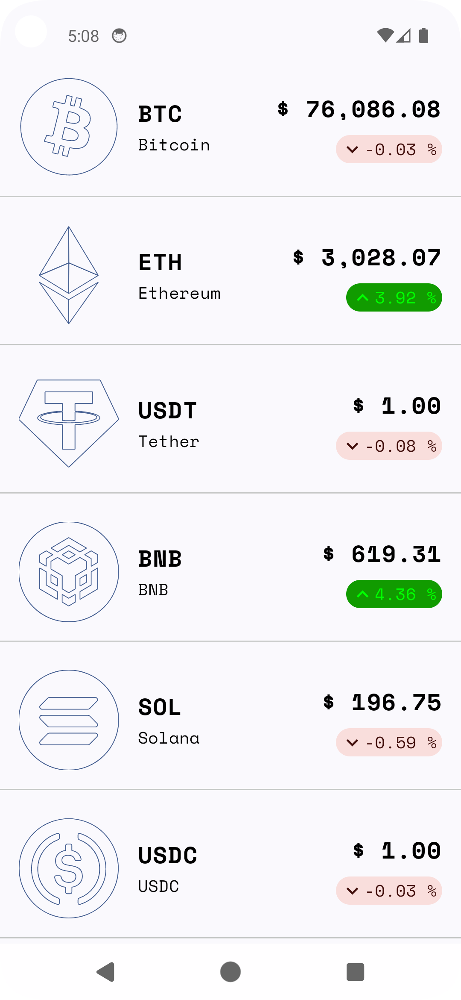
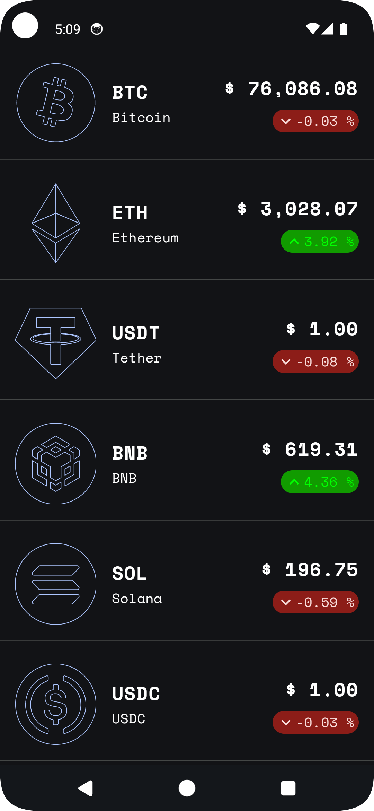
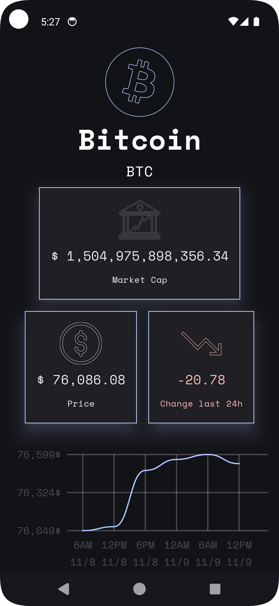
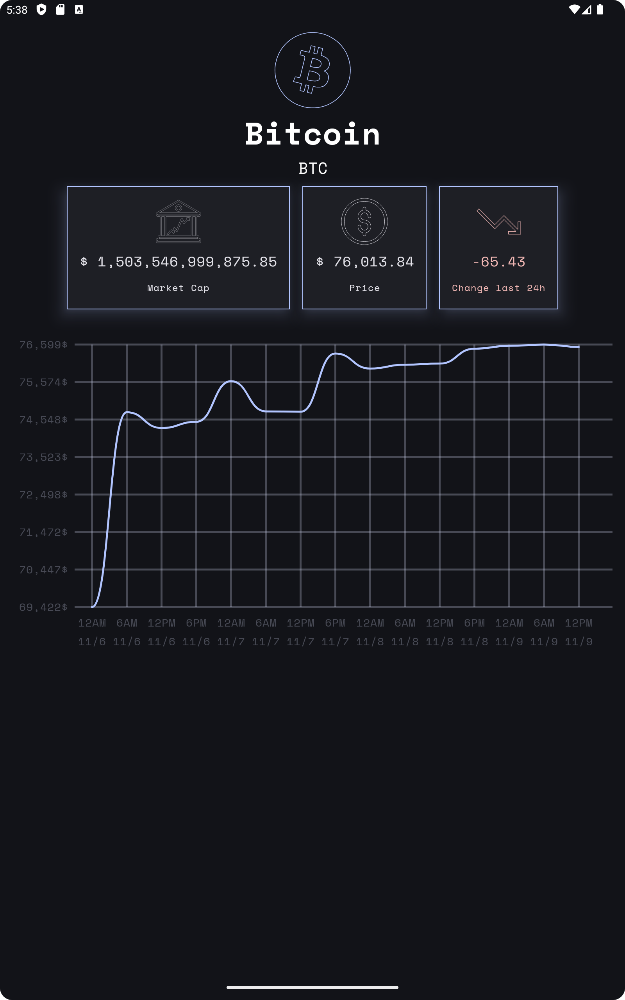
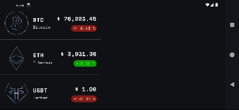
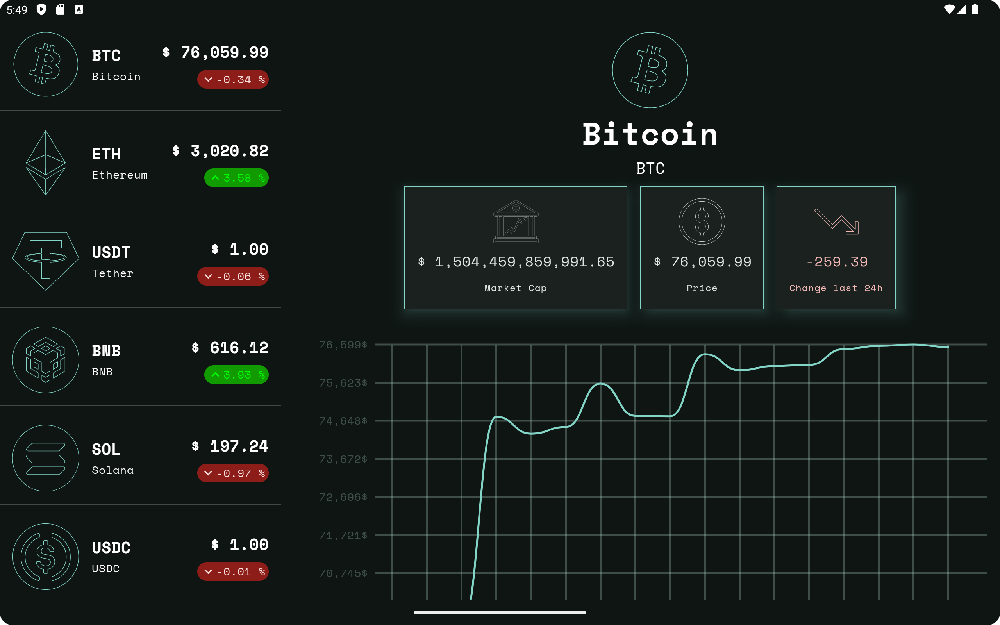

# Crypto Tracker

## 프로젝트 개요

> 외국 비공개 강의에서 다뤘던 프로젝트의 아키텍처와 디자인을 레퍼런스 삼아서 작성했습니다.
> 구글에서 권장하는 패턴으로 정돈된 아키텍처를 사용하고, 평소에 주로 사용하지 않던 라이브러리와 디자인 패턴도 활용해보는 것이 목표였습니다.  
> 앱 자체는 단일 모듈로 작성되었지만, 멀티 모듈 클린 아키텍처를 염두에 둔 구조를 사용했고, MVI 패턴을 기반으로 Presentation 레이어를 구성했습니다. 또 에러 핸들링을 위해 평소 도입하던 Result 패턴을, 강의를 공부하며 익힌 발전된 형태로 적용해 보았습니다.  
> CoinCap API를 받아와 가상 화폐들의 가격 변동 정보 및 그 동향을 보여주는 간단한 기능을 가지고 있으며, UI는 Compose와 Material3를 이용해 구현했습니다.

## 기능 소개

### 코인 목록 화면

CoinCap API로 부터 받은 가상 화폐들과 그 가격 정보를 목록으로 표시합니다. 24시간 동안 변동된 가격을 바탕으로 등락에 대한 정보를 함께 표시합니다. 
 

    
    

*DynamicColor 및 다크모드 여부를 반영합니다.*
  

### 코인 상세 화면
코인 목록 화면의 코인 아이템을 선택해 이동할 수 있습니다. 목록에서 제공되던 정보에 더해 시가 총액과 6시간 단위 가격 변동 차트를 제공합니다(차트는 Compose의 Canvas를 이용해 커스텀 되었습니다). 
 

*스마트폰 해상도 및 태블릿 해상도 FlowRow와 커스텀한 컴포넌트로 텍스트가 차지하는 공간 및 다양한 해상도에 대응합니다.*

  

### 가로 모드
**Adaptive Navigation**을 사용하여, 가로 모드 시에는 분할된 화면을 제공합니다. 
 

*스마트폰 환경*   

*태블릿 환경*   

## 개발 환경

**버전 처리** 
Target SDK: Android SDK 35 
Min SDK: Android SDK 26 

**UI** 
Jetpack Compose, Material3, Adaptive Navigation

**네트워크** 
Ktor

**기타 라이브러리** 
의존성 주입(DI): Koin 